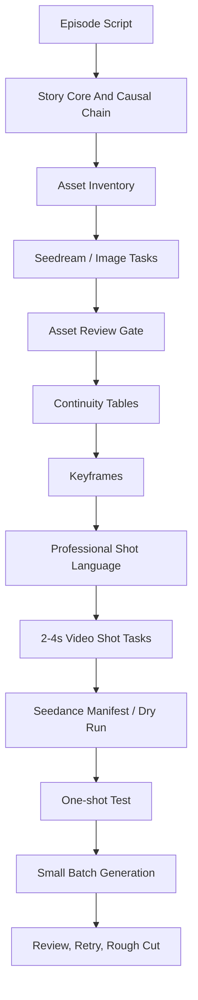

# Short Drama Agent


`short-drama-agent` 是一个面向 AI 短剧生产的 Codex Skill。它的目标不是把剧本改写成“漂亮的分镜文字”，而是把一集短剧拆成一套可以生成、可以审片、可以重跑、可以剪成连续视频的生产文件。

核心原则只有一句：

> 先锁资产和连续性，再生成视频。不要让 AI 视频变成一堆漂亮但互相无关的镜头。

## 适合什么场景

| 场景 | 它会做什么 |
|---|---|
| 你给一集短剧剧本 | 先分析主线、空间、人物、道具、线索，再拆镜头 |
| 你想先生成角色图/场景图/物品图 | 输出 Seedream 或其他图片模型可用的资产任务清单 |
| 你要做连续性镜头 | 给每个镜头写清楚上一镜结束、本镜开始、唯一动作、本镜结束、下一镜衔接 |
| 你要调用 Seedance 逐镜生成 | 输出模型中立镜头表和 Seedance 风格 manifest |
| 你已经有一版粗剪但不连贯 | 根据剧本、manifest、clip/contact sheet 找出需要重做的镜头 |
| 你提供专业短剧 Agent 示例 | 解析 `<location>`、`<role>`、`<duration-ms>` 这类占位符，并替换成具体场景、角色和时长内容 |
| 你想借鉴 Mx-Shell 工作流 | 把 5 段式、真实摄影机/镜头、呼吸感、同期声、瑕疵真实感和结尾留白转成连续性安全的逐镜提示词 |

## 它解决的问题

普通“剧本转视频提示词”很容易失败在这些地方：

- 角色脸、年龄感、发型、服装在镜头之间漂移。
- 空间方向乱掉，入口、出口、危险方向、逃生方向不稳定。
- 道具状态倒退，例如刀已经掉地上，下一镜又回到手里。
- 手机、新闻、短信、监控时间码等中文文字由视频模型直接生成，结果乱码。
- 每个镜头都有氛围，但剪在一起没有因果、动作和视线衔接。
- 一条提示词里塞了太多动作，视频模型不知道该先做哪件事。

`short-drama-agent` 用“资产先行 + 连续性状态机 + 逐镜生成 + 审片重跑”的方式处理这些问题。



## 核心能力

| 能力 | 主要输出 | 作用 |
|---|---|---|
| 剧本分析 | `ai-production-plan.md` | 找出本集真正的故事核心、因果链、观众信息和情绪曲线 |
| 资产抽取 | `assets/asset-manifest.json` | 抽取角色、场景、物品、线索、UI 留白、关键帧 |
| 图片任务 | `assets/image-generation-tasks.json` | 为 Seedream 5.0 lite 或其他图片模型准备生成任务 |
| 资产验收 | asset review table | 判断资产是否可锁定为视频参考图 |
| 连续性监督 | continuity tables | 固定空间方向、角色状态、道具状态、线索揭示顺序 |
| 专业镜头语言 | `professional-shot-prompts.md` | 把占位符示例解析成自然、专业、可复制的视频提示词 |
| Mx-Shell式质感层 | shot metadata | 增加 `core_theme_tags`、`camera_lens_profile`、`sound_policy`、`imperfection_anchors` |
| 视频镜头任务 | `video-shot-tasks.json` | 每镜 2-4 秒，只发生一件事，带开始/结束/衔接/禁止变化 |
| Seedance manifest | `seedance-prompts.json` | 兼容本仓库脚本的逐镜视频生成任务 |
| 审片重跑 | report / rejected clips | 只重写失败镜头，保留已通过镜头 |
| 本地测试 | `scripts/run_skill_tests.py` | 验证每个测试 prompt 都能落到实际能力上 |

## 参考了哪些东西

### 1. 用户提供的短剧 Agent 生产提示词

原始需求被拆成了可执行的生产契约，而不是保留为一段超长提示词。重点包括：

- 先分析剧本，再写分镜。
- 建立场景空间表、角色连续性表、道具状态表、线索揭示表、动作因果表、转场动机表。
- 每个镜头必须包含上一镜结束状态、本镜开始状态、唯一动作、本镜结束状态、下一镜衔接和禁止变化。
- 复杂中文文字、手机消息、新闻推送、字幕、监控时间码、文件内容都交给后期叠加。
- 先做 8-16 张关键帧，再进入视频镜头生成。
- 每个镜头必须服务于因果、空间、动作、信息或剪辑点。

对应文件：

- [`SKILL.md`](./SKILL.md)
- [`references/production-plan-contract.md`](./references/production-plan-contract.md)
- [`references/asset-to-video-pipeline.md`](./references/asset-to-video-pipeline.md)

### 2. 专业短剧 Agent 分镜样例

这个 skill 吸收了专业样例里的镜头语言，但不会机械复制其中的标签。

样例中的 `<location>L1</location>`、`<role>R5</role>`、`<duration-ms>6000</duration-ms>` 被视为占位符：

| 占位符 | 解析方式 |
|---|---|
| `<location>L1</location>` | 替换成具体场景名称、空间方向、关键物体位置和场景母版图 |
| `<role>R5</role>` | 替换成具体角色姓名、外貌、服装、状态、位置和角色参考图 |
| `<duration-ms>6000</duration-ms>` | 转成 `duration_ms` / `edit_target_duration`，必要时与视频模型实际生成时长分开 |

最终输出不会保留 XML-like 标签，除非目标视频接口明确要求。它会输出自然的专业镜头语言，例如：

```text
分镜1，目标剪辑时长6000毫秒。恐怖悬疑短剧，真人写实摄影风格，低饱和冷色，局部硬光切出戏剧性阴影。旧城区烂尾楼三层案发房间内，机位贴近潮湿混凝土地面，28mm 广角，荷兰角，极端近景。沈砚仰躺在画面右下方，面部朝上，眼睛猛地睁开，瞳孔惊恐失焦；镜头像他的主观意识一样剧烈晃动，焦点转移到他的右手掌心，掌心沾着黏腻血迹。他在心里想：“这不是公司机房。”此时他没有张嘴。禁止改变沈砚发型、服装、脸型、地面血迹位置和烂尾楼空间方向。
```

参考文件：

- [`references/tagged-storyboard-format.md`](./references/tagged-storyboard-format.md)

### 3. Codex Skill 工程规范

Skill 结构遵循本地 `skill-creator` 的思路：

- `SKILL.md` 只保留高频触发和主流程。
- 详细格式、输出契约和专业镜头语言放进 `references/`。
- 可重复验证的逻辑放进 `scripts/`。
- UI metadata 放进 `agents/openai.yaml`。
- 使用 progressive disclosure，避免每次触发都加载无关细节。

### 4. Mx-Shell / ai-shortfilm-prompts 工作流

本次优化参考了 Mx-Shell 工作流仓库：

- [ai-shortfilm-prompts](https://github.com/jnMetaCode/ai-shortfilm-prompts)
- [Mx-Shell 提示词方法论](https://github.com/jnMetaCode/ai-shortfilm-prompts/blob/main/methodology.zh.md)
- [shortfilm-prompt Claude Skill](https://github.com/jnMetaCode/ai-shortfilm-prompts/tree/main/.claude/skills/shortfilm-prompt)

吸收的是方法，不是照搬原始提示词：

- 5 段式结构：核心主题、人物场景、氛围画质、运镜规则、分镜时间轴。
- 真实摄影机和镜头型号作为视觉锚点。
- 轻微“呼吸感”手持浮动，避免 CG 式僵硬。
- 明确同期声策略，避免让模型乱配乐。
- 用瑕疵、磨损、污渍、划痕建立真实感。
- 结尾留白，不靠额外爆炸、胜利姿势或强光填满。
- 避免 IP 名、品牌名和角色名触发 Seedance 等模型过滤。

在 `short-drama-agent` 里，这些技巧被放到 [`references/mx-shell-workflow-adapter.md`](./references/mx-shell-workflow-adapter.md)，作为逐镜提示词的最后质感层；它不能覆盖连续性、因果链、道具状态和线索揭示顺序。

### 5. Darwin Skill 优化标准

该 skill 按 Darwin/SkillLens 风格做过结构化优化，重点是：

- 明确触发范围和失败模式。
- 把 CHECKPOINT 写成硬边界。
- 用测试 prompt 覆盖真实使用路径。
- 把“会生成好看的文字”改成“会生成可执行生产文件”。
- 对资产缺失、付费 API、覆盖文件、删除素材等风险做显式处理。

### 6. Seedream / Seedance 生产流程

工作流参考火山方舟 Seedream 和 Seedance 的官方接口与提示词实践：

- Seedream 用作角色参考图、场景母版图、物品图、线索图、UI 留白图和关键帧图生成。
- Seedance 用作逐镜视频生成。
- 图片先生成并验收，视频后生成。
- 视频生成从 `dry-run`、单镜测试、小批量开始，避免一次性烧完整集成本。

参考链接：

- [Seedream 5.0 lite API 参考](https://www.volcengine.com/docs/82379/1541523)
- [Seedream 4.0-5.0 教程](https://www.volcengine.com/docs/82379/1824692)
- [Seedream 4.0-5.0 提示词指南](https://www.volcengine.com/docs/82379/1829186)
- [Seedream 4.0 助力 Seedance 生视频最佳实践](https://www.volcengine.com/docs/82379/1951250)
- [Seedance 创建视频生成任务 API](https://www.volcengine.com/docs/82379/1520757)
- [Seedance 查询视频生成任务 API](https://www.volcengine.com/docs/82379/1521309)
- [Seedance-1.5-pro 提示词指南](https://www.volcengine.com/docs/82379/2168087)
- [Seedance 2.0 提示词指南](https://www.volcengine.com/docs/82379/2222480)

## 安装

### 项目内安装

在你的项目根目录执行：

```bash
mkdir -p .codex/skills
git clone git@github.com:MrMO0802/short-drama-agent.git .codex/skills/short-drama-agent
```

项目内安装只影响当前项目，适合一个短剧项目单独维护一套 Agent 规则。

### 全局安装

```bash
mkdir -p ~/.codex/skills
git clone git@github.com:MrMO0802/short-drama-agent.git ~/.codex/skills/short-drama-agent
```

全局安装后，Codex 在任意项目里都可以识别 `short-drama-agent`。

### 更新

项目内安装：

```bash
git -C .codex/skills/short-drama-agent pull
```

全局安装：

```bash
git -C ~/.codex/skills/short-drama-agent pull
```

如果你是在本项目中开发 skill，也可以把 `skills/short-drama-agent/` 同步到安装目录：

```bash
rsync -a skills/short-drama-agent/ .codex/skills/short-drama-agent/
rsync -a skills/short-drama-agent/ ~/.codex/skills/short-drama-agent/
```

## 文件结构

```text
short-drama-agent/
├── SKILL.md
├── README.md
├── agents/
│   └── openai.yaml
├── references/
│   ├── asset-to-video-pipeline.md
│   ├── mx-shell-workflow-adapter.md
│   ├── production-plan-contract.md
│   └── tagged-storyboard-format.md
├── scripts/
│   ├── run_skill_tests.py
│   ├── seedance_generate.py
│   └── seedream_generate.py
├── tests/
│   └── fixtures/
│       ├── characters.md
│       ├── episodes/
│       └── video/
└── test-prompts.json
```

## 推荐项目结构

在短剧项目里，推荐使用下面的目录：

```text
project-root/
├── episodes/
│   └── ep001.md
├── characters.md
├── creative-plan.md
├── episode-directory.md
├── video/
│   └── ep001/
│       ├── ai-production-plan.md
│       ├── assets/
│       ├── professional-shot-prompts.md
│       ├── video-shot-tasks.json
│       ├── seedance-prompts.json
│       ├── payloads/
│       ├── results/
│       ├── clips/
│       ├── rejected/
│       └── ep001_rough_cut.mp4
└── .codex/
    └── skills/
        └── short-drama-agent/
```

## 使用方式

### 让 Codex 触发 skill

可以直接说：

```text
使用 short-drama-agent，把 episodes/ep001.md 转成 AI 视频制作方案。
```

```text
用短剧 Agent 先提取角色图、场景图、物品图、线索图，再写连续性镜头任务。
```

```text
第一集粗剪不连贯。检查 video/ep001/seedance-prompts.json 和现有 clips，找出需要重做的镜头。
```

```text
我给你一段专业短剧 Agent 分镜样例，根据它优化这一集的专业镜头提示词，但不要保留标签。
```

```text
参考 Mx-Shell 的 ai-shortfilm-prompts 工作流，优化每个 Seedance 镜头的质感，但保持短剧连续性优先。
```

### 输入一集剧本

你可以粘贴全文，也可以给文件路径：

```text
下面是第一集剧本，请输出完整 AI 视频制作方案：

【粘贴剧本全文】
```

```text
使用 short-drama-agent 处理 episodes/ep001.md。
```

skill 会优先读取最小必要上下文：

- 目标剧本，例如 `episodes/ep001.md`
- `characters.md`
- 必要时读取 `creative-plan.md` 或 `episode-directory.md`
- 修订任务中读取已有 `video/epNN/seedance-prompts.json`、关键帧、clips 或 QA contact sheet

## 典型输出文件

处理 `episodes/ep001.md` 时，完整工作流会生成：

```text
video/ep001/
├── ai-production-plan.md
├── assets/
│   ├── asset-manifest.json
│   ├── image-generation-tasks.json
│   ├── characters/
│   ├── scenes/
│   ├── props/
│   ├── clues/
│   ├── ui-plates/
│   └── keyframes/
├── professional-shot-prompts.md
├── video-shot-tasks.json
├── seedance-prompts.json
├── payloads/
├── results/
├── clips/
├── rejected/
├── concat.txt
└── ep001_rough_cut.mp4
```

### `ai-production-plan.md`

这是主生产方案，包含：

- 本集一句话故事核心
- 主线因果链
- 观众必须看懂的信息
- 情绪曲线
- 视觉锚点
- 场景空间表
- 角色连续性表
- 道具状态表
- 线索/信息揭示表
- 动作因果表
- 镜头转场动机表
- 角色参考图提示词
- 场景母版图提示词
- 道具/线索参考图提示词
- 8-16 张关键帧
- 视频镜头任务卡
- 剪辑声音桥建议
- 后期叠加建议
- AI 生成风险清单
- 最终检查清单

### `assets/asset-manifest.json`

资产总表，记录每个资产：

- `asset_id`
- `type`: `character` / `scene` / `prop` / `clue` / `ui_plate` / `keyframe`
- `target_path`
- `prompt`
- `negative_prompt`
- `dependencies`
- `acceptance_criteria`
- `status`

### `assets/image-generation-tasks.json`

图片模型任务清单。适合 Seedream 或 OpenAI-compatible 图片接口。它用于生成：

- 角色参考图
- 场景母版图
- 关键道具图
- 线索特写图
- 手机/电脑/新闻/监控 UI 留白图
- 关键帧图

### `professional-shot-prompts.md`

专业镜头语言文件。它会把样例里的占位符解析为具体内容，并使用更完整的摄影语言：

- 景别：极端近景、特写、中近景、中景、全景、远景、过肩镜头、插入镜头
- 机位：低机位、贴地机位、平视、高机位、俯拍、仰拍、荷兰角、主观视点
- 镜头运动：手持跟拍、缓慢推进、横移、摇镜、甩镜、焦点转移、呼吸式微晃
- 镜头参数：24mm/28mm/35mm/50mm/85mm，浅景深或深焦
- 摄影机/镜头锚点：IMAX film camera + Panavision C-series、Sony Venice + Canon K-35、Kodak 35mm bleach-bypass
- 光线：局部硬光、逆光、轮廓光、冷色环境光、闪烁灯管、低照度高反差
- 真实瑕疵：汗、灰尘、布料磨损、金属划痕、墙面污渍、玻璃裂纹、低饱和颗粒感
- 表演：惊恐失焦、强迫冷静、压低呼吸、僵住、迟疑、回避视线
- 声音：呼吸、脚步、警笛、手机震动、门响、雨声、远处人声、环境底噪

### `video-shot-tasks.json`

模型中立的视频镜头任务。每个镜头必须包含：

- `shot_id`
- `duration` / `duration_ms`
- `generation_duration`
- `edit_target_duration`
- `depends_on_assets`
- `previous_tail_frame`
- `previous_end_state`
- `start_state`
- `single_action`
- `end_state`
- `next_connection`
- `video_prompt`
- `resolved_professional_prompt`
- `core_theme_tags`
- `camera_lens_profile`
- `sound_policy`
- `imperfection_anchors`
- `negative_prompt`
- `acceptance_criteria`
- `status`

### `seedance-prompts.json`

Seedance 风格生成 manifest。兼容 `scripts/seedance_generate.py`，同时可以保留更多审片用元数据，例如：

- `duration_ms`
- `generation_duration`
- `edit_target_duration`
- `resolved_professional_prompt`
- `image_path`
- `image_role`
- `camera_fixed`
- `generate_audio`

## 图片生成

先准备环境变量：

```bash
export ARK_API_KEY="your-api-key"
```

项目安装时推荐这样调用：

```bash
python3 .codex/skills/short-drama-agent/scripts/seedream_generate.py \
  --manifest video/ep001/assets/image-generation-tasks.json \
  --dry-run
```

先生成一张图做测试：

```bash
python3 .codex/skills/short-drama-agent/scripts/seedream_generate.py \
  --manifest video/ep001/assets/image-generation-tasks.json \
  --limit 1
```

指定任务或范围：

```bash
python3 .codex/skills/short-drama-agent/scripts/seedream_generate.py \
  --manifest video/ep001/assets/image-generation-tasks.json \
  --tasks 1,3,5-7 \
  --skip-existing
```

常用参数：

| 参数 | 作用 |
|---|---|
| `--manifest` | 图片任务清单 |
| `--dry-run` | 只写 payload，不调用 API |
| `--limit` | 只生成前 N 个任务 |
| `--tasks` | 按序号或 task_id 选择任务 |
| `--skip-existing` | 跳过已存在输出图 |
| `--model` | 覆盖 manifest 中的模型 |
| `--size` | 覆盖图片尺寸 |
| `--response-format` | `url` 或 `b64_json` |

默认图片模型：

```text
doubao-seedream-5-0-lite-260128
```

## 视频生成

先 dry-run，确认 payload 不会把文本、UI、道具状态、角色状态写错：

```bash
python3 .codex/skills/short-drama-agent/scripts/seedance_generate.py \
  --manifest video/ep001/seedance-prompts.json \
  --dry-run
```

然后只生成一个代表性镜头：

```bash
python3 .codex/skills/short-drama-agent/scripts/seedance_generate.py \
  --manifest video/ep001/seedance-prompts.json \
  --limit 1
```

通过后再小批量生成：

```bash
python3 .codex/skills/short-drama-agent/scripts/seedance_generate.py \
  --manifest video/ep001/seedance-prompts.json \
  --shots 2-5 \
  --skip-existing
```

只轮询已有任务：

```bash
python3 .codex/skills/short-drama-agent/scripts/seedance_generate.py \
  --manifest video/ep001/seedance-prompts.json \
  --poll-only
```

常用参数：

| 参数 | 作用 |
|---|---|
| `--manifest` | 视频任务清单 |
| `--dry-run` | 只写 payload，不调用 API |
| `--limit` | 只生成前 N 个镜头 |
| `--shots` | 按序号或 shot_id 选择镜头 |
| `--skip-existing` | 跳过已有 mp4 |
| `--poll-only` | 只轮询已提交任务 |
| `--resolution` | 覆盖分辨率，例如 `720p` |
| `--ratio` | 覆盖画幅，例如 `9:16` |
| `--duration` | 覆盖模型生成时长 |
| `--model` | 覆盖视频模型 |
| `--generate-audio` / `--no-generate-audio` | 控制是否生成音频 |
| `--watermark` / `--no-watermark` | 控制水印 |

默认视频模型：

```text
doubao-seedance-1-5-pro-251215
```

## 连续性镜头语言

这是本 skill 最重要的部分。它要求每个镜头都像状态机一样写：

```text
上一镜结束状态
    ↓
本镜头开始状态
    ↓
本镜头唯一动作
    ↓
本镜头结束状态
    ↓
下一镜如何衔接
```

每个镜头都要回答：

- 观众这一镜获得了什么新信息？
- 人物为什么从上一镜进入这一镜？
- 人物从哪里来，往哪里去？
- 道具现在在哪里，状态是否变化？
- 这一镜为什么能切到下一镜？
- 哪些东西绝对不能变化？

反模式：

```text
主角醒来，发现尸体，看手机，警察冲进来，然后逃跑。
```

合格拆法：

```text
镜头1：主角眼睛睁开。
镜头2：他的视线落到自己带血的手。
镜头3：他抬头看到白布半遮的尸体。
镜头4：尸体旁的数字“7”进入画面，但文字建议后期叠加。
镜头5：远处警笛声提前进入，他僵住回头。
```

## 占位符解析规则

当输入中出现专业样例：

```text
分镜1<duration-ms>6000</duration-ms>: <role>R5</role> 在 <location>L1</location> 内醒来。
```

skill 应该先建立映射：

```text
L1 = 旧城区烂尾楼三层案发房间
R5 = 沈砚，28岁，白衬衫外套深色西装，右手沾血，刚从昏迷中醒来
duration-ms = 6000 毫秒目标剪辑时长
```

然后输出自然语言：

```text
分镜1，目标剪辑时长6000毫秒。旧城区烂尾楼三层案发房间内，沈砚仰躺在潮湿混凝土地面上，白衬衫和深色西装被灰尘弄脏，右手掌心沾着未干血迹。机位贴近地面，28mm 广角，荷兰角，极端近景，手持轻微晃动。他的眼睛猛地睁开，瞳孔惊恐失焦，随后视线落到自己的右手。他在心里想：“这不是公司机房。”此时他没有张嘴。禁止改变沈砚服装、发型、脸型、手上血迹和烂尾楼空间方向。
```

不要输出：

```text
<role>R5</role> 在 <location>L1</location> 做动作。
```

## 安全边界

skill 会在这些位置要求 `🔴 CHECKPOINT`：

| Checkpoint | 什么时候触发 |
|---|---|
| `overwrite` | 覆盖已有 production plan、JSON manifest 或关键帧文件前 |
| `paid generation` | 调用 Seedream、Seedance 或其他付费媒体 API 前 |
| `asset approval` | 把新生成的角色/场景/道具/关键帧锁定为视频参考前 |
| `destructive cleanup` | 删除素材、移动已接受 clip、清理生成结果前 |
| `ambiguous source` | 无法确定唯一剧本文件时 |

普通分析、写计划、生成 dry-run manifest、写新文件不需要额外确认。

API key 必须放在环境变量或本地 `.env` 中，不能写入 manifest、README、聊天记录或提交历史。

## 测试

在仓库根目录执行：

```bash
python3 scripts/run_skill_tests.py
```

在本项目源目录执行：

```bash
python3 skills/short-drama-agent/scripts/run_skill_tests.py
```

当前测试覆盖：

```text
PASS happy_path_ep001
PASS pasted_script_with_ui
PASS revise_existing_seedance
PASS asset_to_video_execution
PASS professional_placeholder_resolution
PASS mx_shell_workflow_adapter
```

测试会验证：

- 基础 ep001 工作流能找到脚本和输出契约。
- UI/手机/新闻/监控文字被路由到后期叠加。
- 已存在的 Seedance manifest 可以 dry-run。
- Seedream 图片任务可以 dry-run。
- 专业分镜样例中的占位符会被解析，不会原样留在最终提示词里。
- 内心独白和“没有张嘴”规则被保留。
- Mx-Shell式 5 段镜头质感层、摄影机/镜头、同期声、瑕疵真实感和 IP 规避规则存在。

## 质量检查

生成视频前，至少检查这些问题：

- 是否已经抽取角色、场景、物品、线索和关键帧资产？
- 每个视频镜头是否只做一件事？
- 每个镜头是否给观众新增信息或建立必要空间？
- 上一镜结束状态和本镜开始状态是否一致？
- 道具状态是否可追踪？
- 屏幕文字是否都留给后期？
- 专业镜头提示词里是否还有未解析的 `<location>`、`<role>`、`<duration-ms>`？
- 是否用声音桥、视线、动作或信息问题解释了转场？
- 是否先 dry-run，再单镜测试，再小批量生成？
- 失败镜头是否只重写失败部分，避免污染已通过镜头？

## 设计原则

AI 短剧最难的不是单镜“电影感”，而是连续性。

这个 skill 把镜头写成一组可执行的生产状态：

```text
asset state
+ character state
+ prop state
+ space direction
+ action cause
+ edit reason
+ forbidden changes
```

当这些状态稳定，Seedream 和 Seedance 才能从单次生成工具变成可控的短剧生产流水线。
