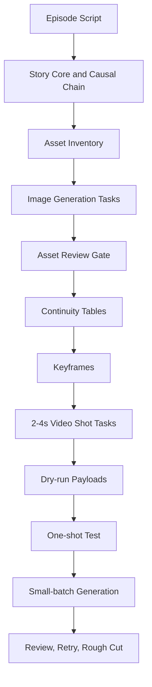

# Short Drama Agent


`short-drama-agent` 是一个面向 AI 短剧生产的 Codex Skill。它不是普通“剧本转分镜”提示词，而是一套把单集短剧剧本转换为可生成、可审片、可重跑、可剪辑的视频生产流水线的执行协议。

它的核心目标很明确：

> 先锁住资产和连续性，再生成视频。不要让 AI 视频变成一堆漂亮但互相无关的镜头。

## What It Does

输入一集短剧剧本后，skill 会推动代理按下面的顺序工作：

1. 解析本集故事核心、主线链条、观众必须看懂的信息和情绪曲线。
2. 抽取角色图、场景图、物品图、线索图、UI 留白图、关键帧图等视觉资产。
3. 为图片模型生成资产任务清单，例如 Seedream 角色参考图、场景母版图、关键道具图、关键帧图。
4. 建立场景空间、角色连续性、道具状态、线索揭示、动作因果和转场动机表。
5. 在资产验收后，编写连续性优先的视频镜头语言。
6. 将整集拆成 2-4 秒的逐镜视频任务。
7. 输出模型中立的 `video-shot-tasks.json` 和 Seedance 风格的 `seedance-prompts.json`。
8. 按 `dry-run -> 单镜测试 -> 小批量生成 -> 审片重跑 -> 粗剪` 的顺序执行。



## Why This Skill Exists

直接把剧本改写成长视频提示词会带来三个高频失败：

- 人物脸、服装和状态在镜头之间漂移。
- 场景方向、入口出口、道具位置无法保持一致。
- 每个镜头都很“好看”，但剪在一起没有因果、空间和动作衔接。

`short-drama-agent` 通过“资产先行 + 状态机式镜头语言 + 逐镜生成”的方式解决这些问题。它把短剧制作拆成导演、分镜师、连续性监督、AI 视频提示词工程师、剪辑顾问几个职责，并让每一步都输出可检查的文件。

## Core Capabilities

| Capability | Output | Purpose |
|---|---|---|
| 剧本理解 | `ai-production-plan.md` | 找出真正的主线、因果链、情绪曲线和观众信息 |
| 资产抽取 | `assets/asset-manifest.json` | 列出角色、场景、物品、线索、UI 留白、关键帧 |
| 图片任务 | `assets/image-generation-tasks.json` | 调用 Seedream 或其他图片模型前的任务清单 |
| 连续性监督 | Markdown tables | 固定空间方向、角色状态、道具状态、线索出现顺序 |
| 关键帧设计 | plan sections + image tasks | 先用图片锁住画面，再进入视频生成 |
| 镜头任务 | `video-shot-tasks.json` | 每个镜头 2-4 秒，只发生一件事 |
| Seedance manifest | `seedance-prompts.json` | 兼容本项目 `scripts/seedance_generate.py` |
| 生成保护 | checkpoints | 付费 API、覆盖文件、资产验收、清理素材前暂停 |
| 本地测试 | `scripts/run_skill_tests.py` | 确认每个测试 prompt 覆盖到实际能力 |

## Reference Design

这个 skill 参考了四类材料。

### 1. 用户提供的短剧 Agent 提示词

原始设计要求包括：

- 先分析剧本，不立刻写镜头。
- 每个镜头都要有上一镜结束状态、本镜头开始状态、唯一动作、本镜头结束状态、下一镜衔接。
- 屏幕文字、新闻推送、短信、监控时间码、UI 信息全部后期叠加。
- 建立场景空间表、角色连续性表、道具状态表、线索揭示表、动作因果表和镜头转场动机表。
- 先设计 8-16 张关键帧，再拆成 2-4 秒视频镜头任务。
- 输出 AI 生成风险清单和最终检查清单。

这些要求被拆入：

- [`SKILL.md`](./SKILL.md)
- [`references/production-plan-contract.md`](./references/production-plan-contract.md)
- [`references/asset-to-video-pipeline.md`](./references/asset-to-video-pipeline.md)

### 2. 项目内短剧创作体系

本项目已有 `short-drama` 本地 skill，负责从选题、人物、分集目录到完整剧本的写作流程。`short-drama-agent` 不替代它，而是接在它后面：

```text
short-drama:       选题 -> 人物 -> 大纲 -> 分集剧本
short-drama-agent: 单集剧本 -> 资产 -> 连续镜头语言 -> 视频生成任务
```

它也兼容本项目现有短剧资产：

- `episodes/epNN.md`
- `characters.md`
- `creative-plan.md`
- `episode-directory.md`
- `video/assets/characters/`
- `video/epNN/seedance-prompts.json`

### 3. Codex Skill 工程规范

Skill 结构参考了本地 `skill-creator` 的规范：

- `SKILL.md` 保持高密度主流程。
- 详细输出契约放到 `references/`。
- 测试脚本放到 `scripts/`。
- `agents/openai.yaml` 提供 UI metadata。
- 使用 progressive disclosure，避免主 skill 过长。

同时参考了 `darwin-skill` 的优化标准：

- 9 维 rubric。
- failure modes 必须显式编码。
- CHECKPOINT 必须显性标记。
- 反模式黑名单必须独立成章。
- 每个测试 prompt 都要跑。
- 结构评分和实测表现分开验证。

### 4. Seedream / Seedance 官方工作流

外部模型流程参考了火山方舟官方文档：

- [Seedream 5.0 lite API 参考](https://www.volcengine.com/docs/82379/1541523)
- [Seedream 4.0-5.0 教程](https://www.volcengine.com/docs/82379/1824692)
- [Seedream 4.0-5.0 提示词指南](https://www.volcengine.com/docs/82379/1829186)
- [Seedream 4.0 助力 Seedance 生视频最佳实践](https://www.volcengine.com/docs/82379/1951250)
- [Seedance 创建视频生成任务 API](https://www.volcengine.com/docs/82379/1520757)
- [Seedance 查询视频生成任务 API](https://www.volcengine.com/docs/82379/1521309)
- [Seedance-1.5-pro 提示词指南](https://www.volcengine.com/docs/82379/2168087)
- [Seedance 2.0 提示词指南](https://www.volcengine.com/docs/82379/2222480)

对应到本 skill 的设计就是：

- Seedream 先生成角色、场景、物品、线索和关键帧。
- Seedance 再基于参考图和连续性镜头语言生成视频片段。
- 所有付费生成都必须经过 `🔴 CHECKPOINT: paid generation`。
- 资产未验收时，只能写 planning/dry-run manifest，不能提交付费视频任务。

## Installed Files

```text
short-drama-agent/
├── SKILL.md
├── README.md
├── agents/
│   └── openai.yaml
├── references/
│   ├── asset-to-video-pipeline.md
│   └── production-plan-contract.md
├── scripts/
│   ├── seedance_generate.py
│   ├── seedream_generate.py
│   └── run_skill_tests.py
├── tests/
│   └── fixtures/
│       ├── characters.md
│       ├── episodes/ep001.md
│       └── video/ep001/seedance-prompts.json
└── test-prompts.json
```

In this project, the same helper scripts also exist at the project root:

```text
scripts/
├── install_short_drama_agent_skill.py
├── seedance_generate.py
└── seedream_generate.py
```

## Output Files

For `episodes/ep001.md`, the full workflow writes:

```text
video/ep001/
├── ai-production-plan.md
├── assets/
│   ├── asset-manifest.json
│   ├── image-generation-tasks.json
│   ├── characters/
│   ├── scenes/
│   ├── props/
│   ├── clues/
│   ├── ui-plates/
│   └── keyframes/
├── video-shot-tasks.json
├── seedance-prompts.json
├── payloads/
├── results/
├── clips/
├── rejected/
├── concat.txt
└── ep001_rough_cut.mp4
```

## Usage

### Ask Codex To Use The Skill

Examples:

```text
使用 short-drama-agent，把 episodes/ep001.md 转成 AI 视频制作方案。
```

```text
用短剧 Agent 先抽取角色图、场景图、物品图、线索图，再写 Seedance 连续镜头任务。
```

```text
第一集粗剪不连贯。检查 video/ep001/seedance-prompts.json 和 episodes/ep001.md，给出需要重做的连续性方案。
```

### Install Or Refresh

Install to the current project:

```bash
python3 scripts/install_short_drama_agent_skill.py --scope project
```

Install globally:

```bash
python3 scripts/install_short_drama_agent_skill.py --scope global
```

Install both:

```bash
python3 scripts/install_short_drama_agent_skill.py --scope both
```

### Generate Image Assets

The skill prepares `video/epNN/assets/image-generation-tasks.json`. Then run:

```bash
python3 scripts/seedream_generate.py \
  --manifest video/ep001/assets/image-generation-tasks.json \
  --dry-run
```

Generate one image first:

```bash
python3 scripts/seedream_generate.py \
  --manifest video/ep001/assets/image-generation-tasks.json \
  --limit 1
```

### Generate Video Clips

The skill prepares `video/epNN/seedance-prompts.json`. Then run:

```bash
python3 scripts/seedance_generate.py \
  --manifest video/ep001/seedance-prompts.json \
  --dry-run
```

Generate one representative shot first:

```bash
python3 scripts/seedance_generate.py \
  --manifest video/ep001/seedance-prompts.json \
  --limit 1
```

Generate a small batch:

```bash
python3 scripts/seedance_generate.py \
  --manifest video/ep001/seedance-prompts.json \
  --shots 2-5 \
  --skip-existing
```

## Safety Model

The skill deliberately separates planning from paid generation.

| Action | Behavior |
|---|---|
| Writing plans/manifests | Allowed without confirmation |
| Overwriting existing production files | `🔴 CHECKPOINT: overwrite` |
| Calling Seedream/Seedance or other paid APIs | `🔴 CHECKPOINT: paid generation` |
| Using generated assets as locked video references | `🔴 CHECKPOINT: asset approval` |
| Deleting/moving accepted clips | `🔴 CHECKPOINT: destructive cleanup` |
| Missing assets during planning | Mark shots `blocked_by_missing_asset` |
| Missing assets during paid generation | Block submission |

API keys must stay in environment variables or a local `.env`; manifests and chat transcripts must never contain secrets.

## Validation

Run all deterministic tests:

```bash
python3 skills/short-drama-agent/scripts/run_skill_tests.py
```

Expected result:

```text
PASS happy_path_ep001
PASS pasted_script_with_ui
PASS revise_existing_seedance
PASS asset_to_video_execution
```

The tests verify:

- every prompt in `test-prompts.json` maps to actual skill behavior;
- UI text is routed to post overlays;
- existing Seedance manifests can dry-run;
- Seedream image payloads can dry-run;
- installed copies can locate the project root correctly.

When the skill is cloned as a standalone repository, the runner falls back to `tests/fixtures/` so the test suite still works without the full short-drama project.

## Quality Checklist

Before using any generated video tasks, confirm:

- Assets were extracted before shot tasks.
- Every video shot lists dependent asset IDs.
- Character, scene, prop, clue and UI plate assets exist or are marked `to-generate`.
- Missing assets block paid video generation.
- Every shot has previous end state, current start state, one action, end state and next connection.
- Complex Chinese text is reserved for post-production overlay.
- The first batch is generated through dry-run and one-shot test.
- Accepted clips remain unchanged; only failed shots are rewritten.

## Design Principle

This skill assumes the hard part of AI short drama is not “prompt beauty”; it is continuity.

Good output is not a list of stylish shots. Good output is a production state machine:

```text
asset state + character state + prop state + space direction + action cause + edit reason
```

When those are stable, Seedream and Seedance become controllable production tools instead of isolated image/video generators.
